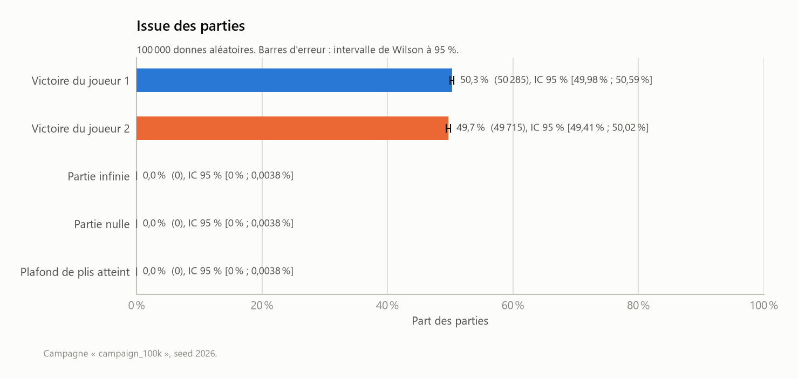
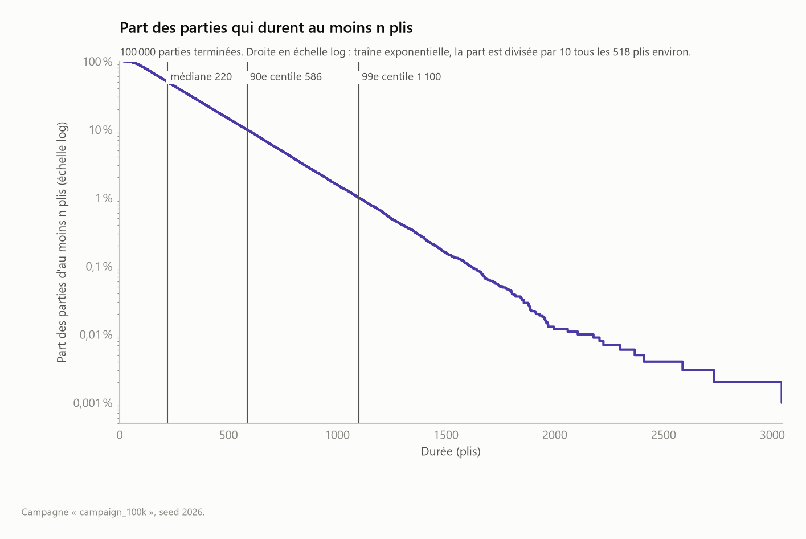
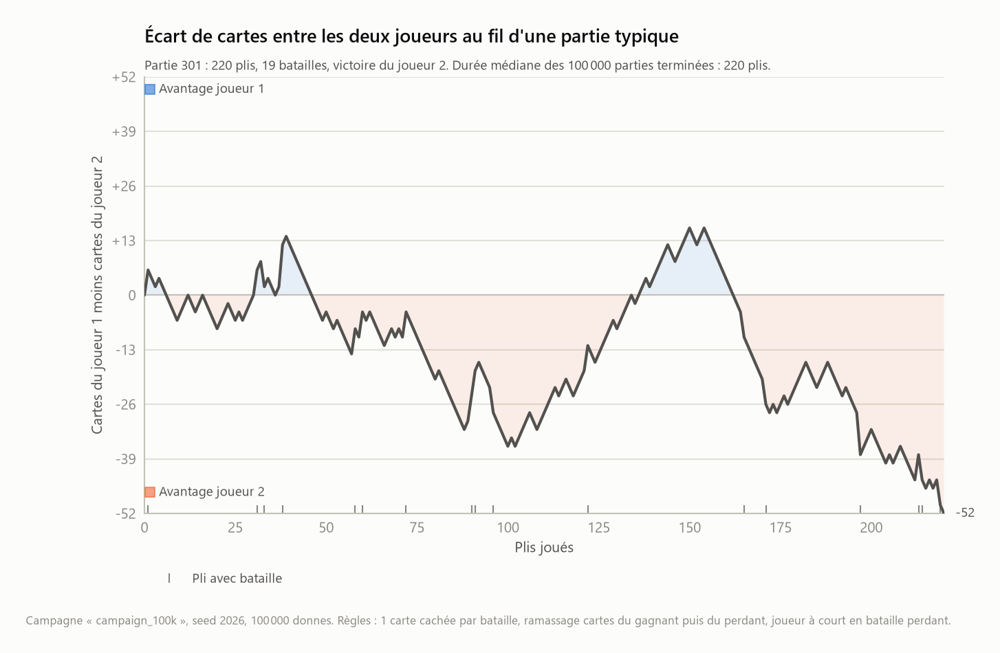
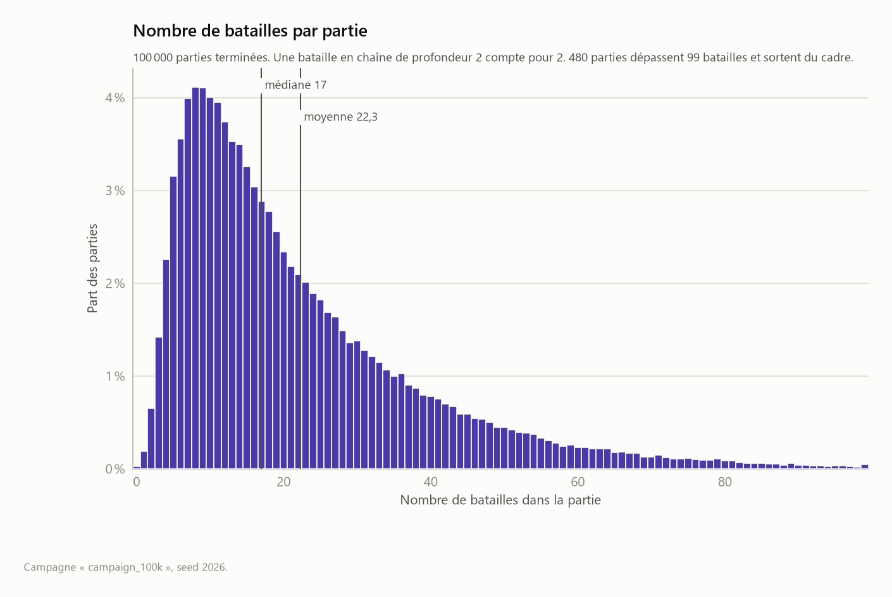
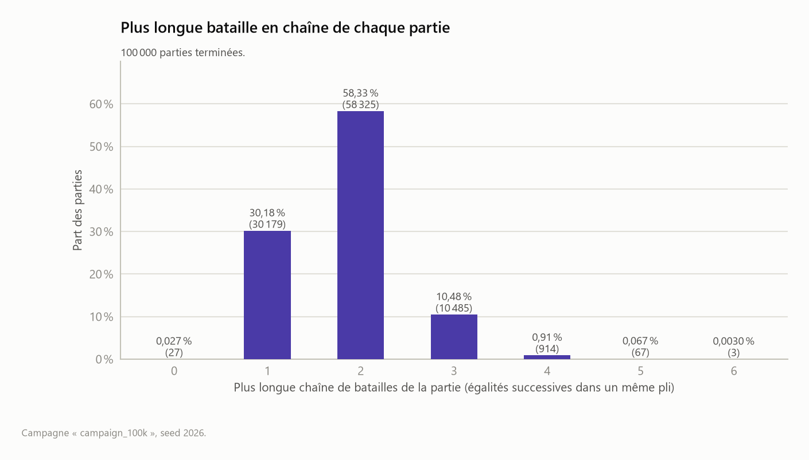
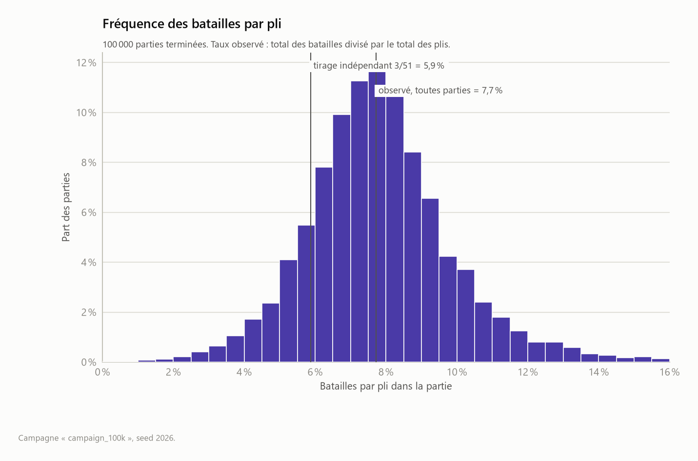

# Analyse des résultats

Ce document rassemble l'analyse des campagnes de simulation au fur et à mesure qu'elles sont produites. Il sert de carnet de travail : les résultats consolidés rejoindront ensuite le README, qui reste le livrable principal.

Chaque chiffre et chaque figure de ce document sont produits par un script de `analysis/` à partir des données brutes de `results/`. Les commandes pour les régénérer sont données à la fin.

## 1. Campagnes disponibles

| Campagne | Seed | Donnes | Règles | Date |
|---|---|---|---|---|
| `campaign_100k` | 2026 | 100 000 | Règles par défaut (ci-dessous) | 2026-09-26 |

**Règles par défaut.** Les points H1 à H5 sont des hypothèses de travail, pas encore tranchées, et paramétrables dans le moteur :

| Hypothèse | Valeur retenue |
|---|---|
| H1, déroulé d'une bataille | 1 carte face cachée, puis 1 carte face visible |
| H2, ramassage après une bataille | Cartes du gagnant dans l'ordre de pose, puis celles du perdant |
| H3, joueur à court pendant une bataille | Il perd la partie. Si les deux sont à court en même temps, la partie est nulle |
| H4, parties infinies | Détection de cycle sur l'état complet (paquet J1, paquet J2) au début de chaque pli |
| H5, garde-fou | 100 000 plis au maximum (valeur provisoire) |

Chaque donne est tirée d'un flux aléatoire propre, dérivé de la seed de campagne et de l'indice de la partie. N'importe quelle partie peut donc être rejouée seule.

## 2. Méthodologie statistique

- **Proportions** (issues, gagnant) : intervalle de Wilson à 95 %. Il reste fiable pour des proportions proches de 0, ce qui est le cas des parties infinies.
- **Moyennes** : intervalle normal à 95 %, moyenne plus ou moins 1,96 écart-type divisé par la racine de n. Avec 100 000 parties, l'approximation est largement justifiée malgré l'asymétrie des distributions.
- **Médianes** : intervalle à 95 % par bootstrap, 2 000 rééchantillonnages, seed de rééchantillonnage fixée à 0.
- **Traîne des durées** : ajustement linéaire du logarithme de la part des parties d'au moins n plis, entre la médiane et le 99,9e centile. Au-delà, trop peu de parties pour que la courbe soit stable.
- **Partie typique** : la partie terminée dont la durée est la plus proche de la médiane, et à égalité celle d'indice le plus petit. La médiane est préférée à la moyenne car la distribution des durées a une longue traîne à droite (section 4).

## 3. Issue des parties



| Issue | Parties | Proportion | IC 95 % |
|---|---|---|---|
| Victoire du joueur 1 | 50 285 | 50,29 % | [49,98 % ; 50,59 %] |
| Victoire du joueur 2 | 49 715 | 49,71 % | [49,41 % ; 50,02 %] |
| Partie infinie (cycle) | 0 | 0 % | [0 % ; 0,0038 %] |
| Partie nulle | 0 | 0 % | [0 % ; 0,0038 %] |
| Plafond de plis atteint | 0 | 0 % | [0 % ; 0,0038 %] |

**Observations :**

- Aucune partie infinie sur 100 000. On peut seulement affirmer que leur proportion est inférieure à 0,0038 % environ, soit moins d'une partie sur 26 000, avec ces règles. Mesurer une fréquence aussi faible demandera des campagnes beaucoup plus grandes.
- Le plafond de 100 000 plis n'a jamais servi : la partie la plus longue dure 3 044 plis. Il pourra être abaissé sans risque lorsque H5 sera tranchée.
- Aucun avantage mesurable pour l'un ou l'autre joueur : l'intervalle de confiance de chaque joueur contient 50 %. C'est attendu, les deux mains étant tirées de manière symétrique.

## 4. Durée des parties

### Distribution


Durée en plis, sur les 100 000 parties terminées :

| Statistique | Valeur |
|---|---|
| Moyenne | 289,1 plis, IC 95 % [287,7 ; 290,5] |
| Médiane | 220 plis, IC 95 % [219 ; 222] |
| Écart-type | 226,0 plis |
| Minimum | 19 plis |
| 1er quartile | 130 plis |
| 3e quartile | 378 plis |
| Maximum | 3 044 plis |

**Observations :**

- La distribution est très asymétrique : le mode se situe autour de 100 à 120 plis, la médiane à 220, la moyenne à 289. L'écart-type est du même ordre que la moyenne.
- Les parties les plus courtes durent 19 et 20 plis (parties 81910, 23006 et 37430), avec 5 à 7 batailles chacune. Une bataille gagnée prend 3 cartes à l'adversaire au lieu d'une, ce qui permet de finir vite. Une partie sans bataille ne peut pas durer moins de 26 plis.

### Traîne



| Statistique | Valeur |
|---|---|
| 90e centile | 586 plis |
| 99e centile | 1 100 plis |
| Décroissance de la traîne | part divisée par 10 tous les 518 plis environ |

**Observations :**

- En échelle logarithmique, la part des parties d'au moins n plis décroît en ligne droite de la médiane jusqu'à environ 2 000 plis : la traîne est exponentielle. Une partie sur dix dépasse 586 plis, une sur cent dépasse 1 100 plis, une sur mille dépasse environ 1 600 plis.
- Une traîne exponentielle signifie qu'une partie longue n'a pas de « mémoire » : quelle que soit la durée déjà écoulée, la probabilité qu'elle dure encore 518 plis de plus reste d'environ 10 %. Ce point est une lecture de la courbe, à confirmer par un test d'ajustement.
- Au-delà de 2 000 plis, la courbe ne repose plus que sur une dizaine de parties et devient irrégulière.

### Partie typique



La partie 301 dure 220 plis, exactement la médiane. Elle compte 19 batailles et se termine par la victoire du joueur 2.

Le joueur 2 mène pendant 76 % des plis, le joueur 1 pendant 20 %. Le joueur 1 prend deux fois l'avantage, jusqu'à 14 cartes d'avance vers le pli 39 et 16 cartes vers le pli 150, mais le joueur 2 reprend chaque fois la main, après être déjà monté à 36 cartes d'avance vers le pli 100. Une seule partie ne permet aucune généralisation : cette figure illustre le déroulé d'une partie, elle ne mesure rien.

## 5. Batailles

### Nombre de batailles par partie



Une égalité compte pour une bataille, et une bataille en chaîne de profondeur 2 compte pour deux.

| Statistique | Valeur |
|---|---|
| Moyenne | 22,3 batailles, IC 95 % [22,2 ; 22,4] |
| Médiane | 17 batailles, IC 95 % [17 ; 17] |
| Écart-type | 17,8 |
| 1er quartile / 3e quartile | 10 / 29 |
| 90e centile / 99e centile | 46 / 86 |
| Minimum / maximum | 0 / 224 |

La distribution a la même forme que celle des durées, ce qui est attendu : plus une partie dure, plus elle accumule de batailles.

### Batailles en chaîne



| Plus longue chaîne | Parties | Proportion |
|---|---|---|
| 0 (aucune bataille) | 27 | 0,027 % |
| 1 | 30 179 | 30,18 % |
| 2 | 58 325 | 58,33 % |
| 3 | 10 485 | 10,49 % |
| 4 | 914 | 0,91 % |
| 5 | 67 | 0,067 % |
| 6 | 3 | 0,003 % |

**Observations :**

- Une bataille en chaîne (au moins deux égalités de suite) se produit dans 70 % des parties.
- Chaque profondeur supplémentaire divise environ par 10 le nombre de parties concernées, à partir de 3, et un peu plus au-delà.

### Fréquence des batailles par pli



| Statistique | Valeur |
|---|---|
| Batailles au total | 2 231 989 |
| Plis au total | 28 912 727 |
| Batailles par pli, observé | 7,72 % |
| Référence : tirage indépendant, 3/51 | 5,88 % |

**Point à vérifier :** sur l'ensemble des parties, on compte 7,72 % de batailles par pli. Si les deux cartes retournées étaient tirées au hasard dans le paquet, une égalité aurait une probabilité de 3/51, soit 5,88 %. La distribution par partie est nettement centrée au-dessus de cette référence. Cet écart suggère que l'ordre de ramassage fixe crée des corrélations entre les paquets des deux joueurs. Il reste à le confirmer par une mesure directe, pli par pli, et à le comparer avec les autres ordres de ramassage.

## 6. Limites actuelles

- Une seule campagne, avec un seul jeu de règles : aucun résultat ne dit encore rien sur l'effet des hypothèses H1 à H3.
- 100 000 parties ne suffisent pas pour observer des parties infinies si leur fréquence est inférieure à une sur quelques dizaines de milliers.
- Les statistiques des batailles sont agrégées par partie. La fréquence des égalités pli par pli n'est pas encore mesurée directement, et le taux de 7,72 % mélange premières égalités et égalités en chaîne.
- Le caractère exponentiel de la traîne est une lecture graphique, pas encore un test statistique.

## 7. Pistes pour la suite

- Tester formellement l'ajustement exponentiel de la traîne des durées.
- Mesurer la proportion de parties infinies et la structure des cycles, sur une campagne beaucoup plus grande.
- Comprendre l'excès de batailles par rapport au tirage indépendant.
- Étudier le lien entre la main initiale et l'issue : nombre d'As, force moyenne, position des grosses cartes.
- Mesurer l'influence des variantes de règles H1 à H3.

## 8. Reproduire les résultats

Depuis la racine du projet, avec l'environnement `.venv` :

```bash
PYTHONPATH=src .venv/Scripts/python -m bataille.simulate campaign --name campaign_100k --games 100000 --seed 2026
PYTHONPATH=src .venv/Scripts/python -m bataille.simulate trace --name campaign_100k
PYTHONPATH=src .venv/Scripts/python analysis/campaign_summary.py --name campaign_100k
PYTHONPATH=src .venv/Scripts/python analysis/outcomes.py --name campaign_100k
PYTHONPATH=src .venv/Scripts/python analysis/durations.py --name campaign_100k
PYTHONPATH=src .venv/Scripts/python analysis/battles.py --name campaign_100k
PYTHONPATH=src .venv/Scripts/python analysis/typical_game.py --name campaign_100k
```

La campagne de 100 000 parties prend environ une minute et demie.
