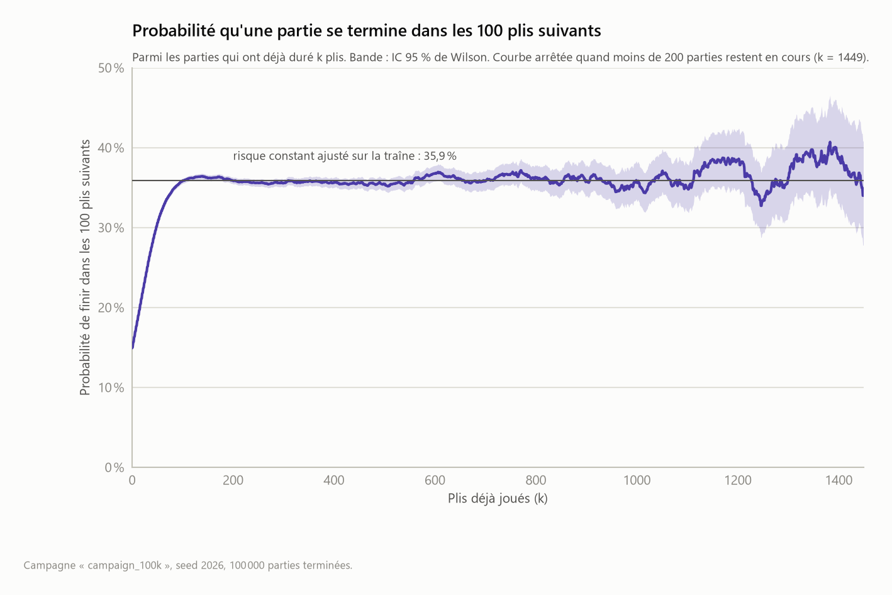
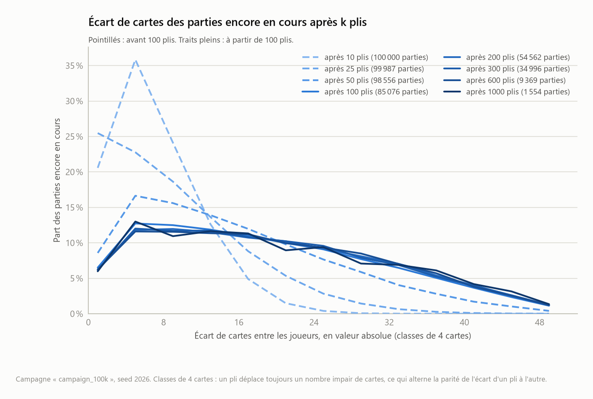
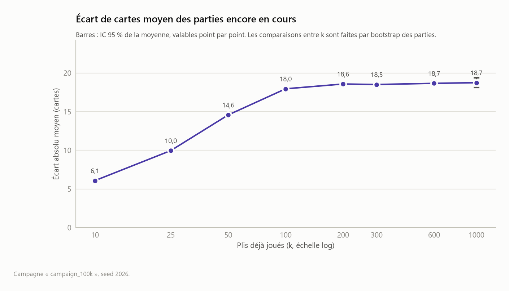
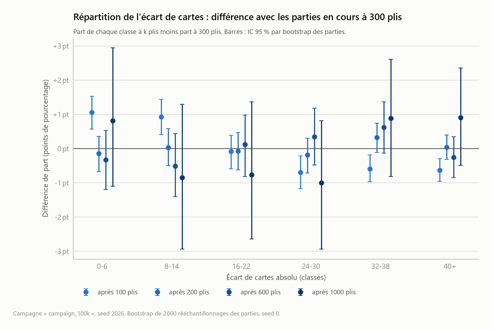
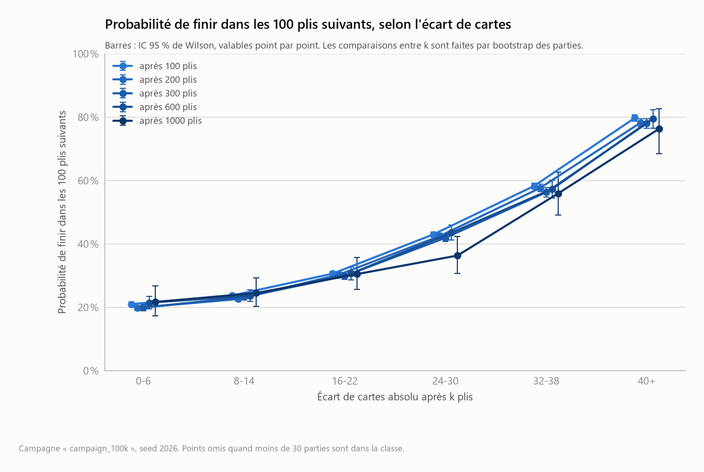
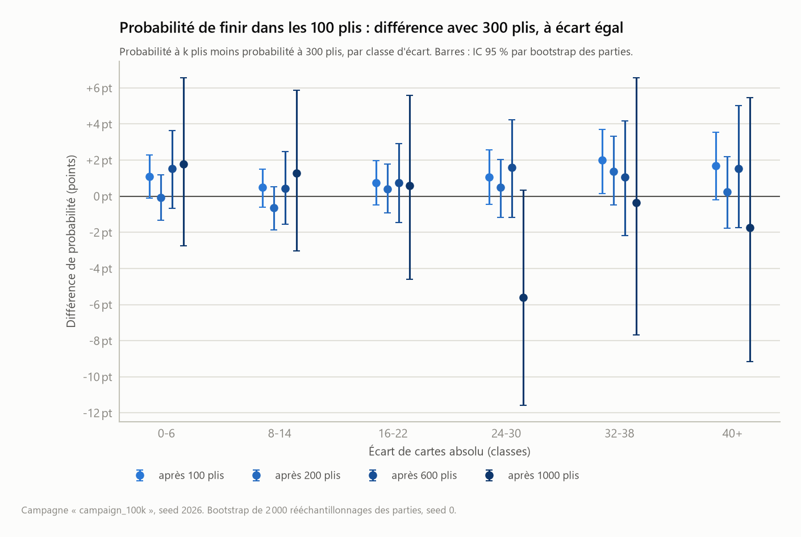

# Analyse des résultats

Ce document rassemble l'analyse des campagnes de simulation au fur et à mesure qu'elles sont produites. Il sert de carnet de travail : les résultats consolidés rejoindront ensuite le README, qui reste le livrable principal.

Chaque chiffre et chaque figure de ce document sont produits par un script de `analysis/` à partir des données brutes de `results/`. Les commandes pour les régénérer sont données à la fin.

## 1. Campagnes disponibles

| Campagne | Seed | Donnes | Règles | Date |
|---|---|---|---|---|
| `campaign_100k` | 2026 | 100 000 | Règles par défaut (ci-dessous) | 2026-09-26 |

**Règles par défaut.** Les points H1 à H5 sont des hypothèses de travail, pas encore tranchées, et paramétrables dans le moteur :

| Hypothèse | Valeur retenue |
|---|---|
| H1, déroulé d'une bataille | 1 carte face cachée, puis 1 carte face visible |
| H2, ramassage après une bataille | Cartes du gagnant dans l'ordre de pose, puis celles du perdant |
| H3, joueur à court pendant une bataille | Il perd la partie. Si les deux sont à court en même temps, la partie est nulle |
| H4, parties infinies | Détection de cycle sur l'état complet (paquet J1, paquet J2) au début de chaque pli |
| H5, garde-fou | 100 000 plis au maximum (valeur provisoire) |

Chaque donne est tirée d'un flux aléatoire propre, dérivé de la seed de campagne et de l'indice de la partie. N'importe quelle partie peut donc être rejouée seule.

## 2. Méthodologie statistique

- **Proportions** (issues, gagnant) : intervalle de Wilson à 95 %. Il reste fiable pour des proportions proches de 0, ce qui est le cas des parties infinies.
- **Moyennes** : intervalle normal à 95 %, moyenne plus ou moins 1,96 écart-type divisé par la racine de n. Avec 100 000 parties, l'approximation est largement justifiée malgré l'asymétrie des distributions.
- **Médianes** : intervalle à 95 % par bootstrap, 2 000 rééchantillonnages, seed de rééchantillonnage fixée à 0.
- **Traîne des durées** : ajustement linéaire du logarithme de la part des parties d'au moins n plis, entre la médiane et le 99,9e centile. Au-delà, trop peu de parties pour que la courbe soit stable.
- **Probabilité de terminaison** : pour chaque durée k déjà jouée, part des parties encore en cours après k plis qui se terminent au plus tard au pli k + 100, avec un intervalle de Wilson à 95 %. La courbe s'arrête quand moins de 200 parties restent en cours.
- **Distribution quasi stationnaire** : l'écart de cartes des parties encore en cours est relevé à des plis de contrôle en rejouant toutes les parties. Ces relevés portent sur les mêmes parties et ne sont donc pas indépendants. Les comparaisons avec la référence k = 300 se font par bootstrap au niveau des parties (2 000 rééchantillonnages, seed 0), qui donne une taille d'effet et son intervalle à 95 %. Un khi-deux d'homogénéité sur deux moitiés disjointes des parties (seed de partage 1) sert de contrôle.
- **Partie typique** : la partie terminée dont la durée est la plus proche de la médiane, et à égalité celle d'indice le plus petit. La médiane est préférée à la moyenne car la distribution des durées a une longue traîne à droite (section 4).

## 3. Issue des parties


| Issue | Parties | Proportion | IC 95 % |
|---|---|---|---|
| Victoire du joueur 1 | 50 285 | 50,29 % | [49,98 % ; 50,59 %] |
| Victoire du joueur 2 | 49 715 | 49,71 % | [49,41 % ; 50,02 %] |
| Partie infinie (cycle) | 0 | 0 % | [0 % ; 0,0038 %] |
| Partie nulle | 0 | 0 % | [0 % ; 0,0038 %] |
| Plafond de plis atteint | 0 | 0 % | [0 % ; 0,0038 %] |

**Observations :**

- Aucune partie infinie sur 100 000. On peut seulement affirmer que leur proportion est inférieure à 0,0038 % environ, soit moins d'une partie sur 26 000, avec ces règles. Mesurer une fréquence aussi faible demandera des campagnes beaucoup plus grandes.
- Le plafond de 100 000 plis n'a jamais servi : la partie la plus longue dure 3 044 plis. Il pourra être abaissé sans risque lorsque H5 sera tranchée.
- Les données ne mettent pas en évidence d'avantage pour l'un ou l'autre joueur : les intervalles de confiance contiennent 50 %. Cela ne démontre pas l'absence de tout avantage, seulement qu'aucun écart n'est détecté avec cet échantillon. C'est le résultat attendu, les deux mains étant tirées de manière symétrique.

## 4. Durée des parties

### Distribution


Durée en plis, sur les 100 000 parties terminées :

| Statistique | Valeur |
|---|---|
| Moyenne | 289,1 plis, IC 95 % [287,7 ; 290,5] |
| Médiane | 220 plis, IC 95 % [219 ; 222] |
| Écart-type | 226,0 plis |
| Minimum | 19 plis |
| 1er quartile | 130 plis |
| 3e quartile | 378 plis |
| Maximum | 3 044 plis |

**Observations :**

- La distribution est très asymétrique : le mode se situe autour de 100 à 120 plis, la médiane à 220, la moyenne à 289. L'écart-type est du même ordre que la moyenne.
- Les parties les plus courtes durent 19 et 20 plis (parties 81910, 23006 et 37430), avec 5 à 7 batailles chacune. Une bataille gagnée prend 3 cartes à l'adversaire au lieu d'une, ce qui permet de finir vite. Une partie sans bataille ne peut pas durer moins de 26 plis.

### Traîne


| Statistique | Valeur |
|---|---|
| 90e centile | 586 plis |
| 99e centile | 1 100 plis |
| Décroissance de la traîne | part divisée par 10 tous les 518 plis environ |

**Observations :**

- En échelle logarithmique, la part des parties d'au moins n plis décroît en ligne droite de la médiane jusqu'à environ 2 000 plis : la traîne est compatible avec un comportement géométrique, l'équivalent discret d'une loi exponentielle pour une durée comptée en plis. Une partie sur dix dépasse 586 plis, une sur cent dépasse 1 100 plis, une sur mille dépasse environ 1 600 plis.
- Un comportement géométrique signifie que, dans cette phase, le risque de terminaison par pli est approximativement constant : sachant que la partie a déjà duré k plis, la probabilité qu'elle dure encore 518 plis est approximativement la même, environ 10 %, quel que soit k. La section 6 l'examine directement : passé 100 plis, la probabilité de finir dans les 100 plis suivants ne varie pas de façon détectable et reste autour de 36 %.
- Au-delà de 2 000 plis, la courbe ne repose plus que sur une dizaine de parties et devient irrégulière.

### Partie typique


La partie 301 dure 220 plis, exactement la médiane. Elle compte 19 batailles et se termine par la victoire du joueur 2.

Le joueur 2 mène pendant 76 % des plis, le joueur 1 pendant 20 %. Le joueur 1 prend deux fois l'avantage, jusqu'à 14 cartes d'avance vers le pli 39 et 16 cartes vers le pli 150, mais le joueur 2 reprend chaque fois la main, après être déjà monté à 36 cartes d'avance vers le pli 100. Une seule partie ne permet aucune généralisation : cette figure illustre le déroulé d'une partie, elle ne mesure rien.

## 5. Batailles

### Nombre de batailles par partie


Une égalité compte pour une bataille, et une bataille en chaîne de profondeur 2 compte pour deux.

| Statistique | Valeur |
|---|---|
| Moyenne | 22,3 batailles, IC 95 % [22,2 ; 22,4] |
| Médiane | 17 batailles, IC 95 % [17 ; 17] |
| Écart-type | 17,8 |
| 1er quartile / 3e quartile | 10 / 29 |
| 90e centile / 99e centile | 46 / 86 |
| Minimum / maximum | 0 / 224 |

La distribution a la même forme que celle des durées, ce qui est attendu : plus une partie dure, plus elle accumule de batailles.

### Batailles en chaîne


| Plus longue chaîne | Parties | Proportion |
|---|---|---|
| 0 (aucune bataille) | 27 | 0,027 % |
| 1 | 30 179 | 30,18 % |
| 2 | 58 325 | 58,33 % |
| 3 | 10 485 | 10,49 % |
| 4 | 914 | 0,91 % |
| 5 | 67 | 0,067 % |
| 6 | 3 | 0,003 % |

**Observations :**

- Une bataille en chaîne (au moins deux égalités de suite) se produit dans 70 % des parties.
- Chaque profondeur supplémentaire divise environ par 10 le nombre de parties concernées, à partir de 3, et un peu plus au-delà.

### Fréquence des batailles par pli


| Statistique | Valeur |
|---|---|
| Batailles au total | 2 231 989 |
| Plis au total | 28 912 727 |
| Batailles par pli, observé | 7,72 % |
| Référence : tirage indépendant, 3/51 | 5,88 % |

**Point à vérifier :** sur l'ensemble des parties, on compte 7,72 % de batailles par pli. Si les deux cartes retournées étaient tirées au hasard dans le paquet, une égalité aurait une probabilité de 3/51, soit 5,88 %. La distribution par partie est nettement centrée au-dessus de cette référence. Cet écart suggère que l'ordre de ramassage fixe crée des corrélations entre les paquets des deux joueurs. Il reste à le confirmer par une mesure directe, pli par pli, et à le comparer avec les autres ordres de ramassage.

## 6. Probabilité de terminaison

On mesure ici, pour une partie qui a déjà duré k plis, la probabilité qu'elle se termine dans les 100 plis suivants : P(T ≤ k + 100 | T > k). Elle se calcule sur les 100 000 durées enregistrées : parmi les parties encore en cours après k plis, la part de celles qui finissent au plus tard au pli k + 100.



| Plis déjà joués (k) | Parties encore en cours | Terminées dans les 100 plis suivants | Probabilité | IC 95 % |
|---|---|---|---|---|
| 0 | 100 000 | 14 924 | 14,92 % | [14,70 % ; 15,15 %] |
| 100 | 85 076 | 30 514 | 35,87 % | [35,55 % ; 36,19 %] |
| 200 | 54 562 | 19 566 | 35,86 % | [35,46 % ; 36,26 %] |
| 300 | 34 996 | 12 446 | 35,56 % | [35,06 % ; 36,07 %] |
| 400 | 22 550 | 8 040 | 35,65 % | [35,03 % ; 36,28 %] |
| 500 | 14 510 | 5 141 | 35,43 % | [34,66 % ; 36,21 %] |
| 600 | 9 369 | 3 446 | 36,78 % | [35,81 % ; 37,76 %] |
| 700 | 5 923 | 2 126 | 35,89 % | [34,68 % ; 37,12 %] |
| 800 | 3 797 | 1 373 | 36,16 % | [34,65 % ; 37,70 %] |
| 900 | 2 424 | 870 | 35,89 % | [34,01 % ; 37,82 %] |
| 1 000 | 1 554 | 555 | 35,71 % | [33,37 % ; 38,13 %] |
| 1 100 | 999 | 349 | 34,93 % | [32,04 % ; 37,94 %] |
| 1 200 | 650 | 250 | 38,46 % | [34,80 % ; 42,26 %] |
| 1 300 | 400 | 145 | 36,25 % | [31,69 % ; 41,07 %] |
| 1 400 | 255 | 99 | 38,82 % | [33,05 % ; 44,93 %] |

**Observations :**

- **Au départ, une partie a 14,9 % de chances de finir en moins de 100 plis.** Cette probabilité monte rapidement pendant les premiers plis : 25 % à k = 30, 31 % à k = 50, 35 % à k = 90.
- **À partir d'environ 100 plis joués, aucune variation de la probabilité avec la durée déjà écoulée n'est détectée.** Elle reste autour de 36 % jusqu'à 1 400 plis, et tous les intervalles de confiance du tableau contiennent 35,9 %, la valeur attendue d'un comportement géométrique ajusté sur la traîne de la section 4. À la précision mesurée, une partie qui a déjà duré 1 000 plis a les mêmes chances de finir bientôt qu'une partie qui en a duré 100.
- Cette mesure, qui ne passe par aucun ajustement, est compatible avec un comportement géométrique de la traîne : passé les 100 premiers plis, le risque de terminaison par pli paraît approximativement constant. Seule la phase initiale se distingue, sans doute parce qu'aucun joueur ne peut perdre ses 26 cartes en quelques plis.
- Au-delà de 1 100 plis, la courbe oscille davantage (de 33 % à 41 %) car il reste moins de 1 000 parties en cours. Les intervalles s'élargissent en conséquence et restent compatibles avec 36 %.
- Les valeurs de la courbe ne sont pas indépendantes entre elles : les fenêtres de 100 plis se chevauchent d'un k au suivant, et ce sont les mêmes parties qui sont comptées. Les intervalles de confiance sont valables point par point, pas pour la courbe entière.

### Pourquoi un palier à 36 %

**Le calcul.** Si chaque pli a la même probabilité *h* d'être le dernier, la probabilité de finir dans les 100 plis suivants vaut 1 − (1 − *h*)¹⁰⁰, quelle que soit la durée déjà jouée. La traîne mesurée en section 4 (part divisée par 10 tous les 518 plis) donne *h* ≈ 0,44 % par pli, d'où 1 − (1 − 0,0044)¹⁰⁰ ≈ 35,9 %. Le palier et la traîne géométrique sont donc deux lectures d'un même comportement. Une troisième lecture se vérifie sur les données : une fois passée la phase initiale, le nombre moyen de plis restant à jouer devient lui aussi approximativement indépendant de l'âge de la partie.

| Plis déjà joués | Parties encore en cours | Plis restant à jouer, en moyenne |
|---|---|---|
| 0 | 100 000 | 289 |
| 100 | 85 076 | 227 |
| 300 | 34 996 | 227 |
| 600 | 9 369 | 223 |
| 1 000 | 1 554 | 223 |

**L'explication proposée.** On peut voir une partie comme une marche de l'écart de cartes entre −52 et +52, qui s'arrête quand elle touche un bord. Au départ, toutes les parties sont à égalité, 26 contre 26, loin des deux bords : finir vite est presque impossible, d'où les 15 % de départ. Au fil des ramassages, les paquets se brassent et la partie perd la trace de la donne initiale. Selon cette hypothèse, la répartition des situations parmi les parties encore en cours tend vers une forme stable, appelée **distribution quasi stationnaire**. Une fois cette forme atteinte, une partie en cours au pli 300 ressemblerait statistiquement à une partie en cours au pli 1 000, et toutes deux auraient la même probabilité de finir bientôt. La hauteur du palier dépend des règles : avec d'autres règles, il serait à une autre valeur.

Le jeu étant entièrement déterministe, parler de marche au hasard est une approximation. Elle suppose que l'ordre des paquets se comporte comme un mélange aléatoire après une centaine de plis. Cette hypothèse a deux conséquences testables, avec lesquelles les données sont compatibles, comme le montre la suite.

**Méthode de comparaison.** Toutes les parties ont été rejouées pour relever leur écart de cartes après 10, 25, 50, 100, 200, 300, 600 et 1 000 plis, quand elles étaient encore en cours. Ces relevés ne sont pas indépendants d'un pli de contrôle à l'autre : une partie en cours à 600 plis l'est aussi à 100, 200 et 300. Un test classique comme le khi-deux d'homogénéité, qui suppose des échantillons indépendants, n'est donc pas valide pour les comparer. La dépendance rend en outre les échantillons plus semblables qu'ils ne le seraient, ce qui biaiserait le test en faveur de la stabilité. On procède donc autrement :

- **Bootstrap au niveau des parties** (méthode principale). On tire 2 000 fois 100 000 parties avec remise, et chaque partie tirée apporte tous ses relevés. Pour chaque tirage, on recalcule la différence entre un pli de contrôle k et la référence k = 300. Ce bootstrap au niveau des parties conserve la dépendance entre les relevés successifs d'une même partie.
- **Moitiés disjointes** (contrôle). Les parties sont partagées au hasard en deux moitiés. Le pli k est lu sur la première, la référence k = 300 sur la seconde. Les deux échantillons étant indépendants, le khi-deux d'homogénéité redevient valide, au prix d'une puissance plus faible.

Le résultat est exprimé en **taille d'effet avec son intervalle**, et non par une p-valeur seule : une p-valeur élevée dit qu'aucune différence n'a été détectée, pas que les répartitions sont identiques. L'intervalle, lui, borne la différence possible.

**Observation 1 : la répartition de l'écart de cartes parmi les parties en cours cesse de dépendre de k.**







Les classes d'écart absolu sont 0-6, 8-14, 16-22, 24-30, 32-38 et 40 et plus. Les différences sont calculées par rapport à k = 300.

| Plis déjà joués | Parties en cours | Écart absolu moyen | Différence d'écart moyen, IC 95 % bootstrap | Classes dont l'IC exclut 0 | Plus grande borne absolue des IC à 95 % | Khi-deux, moitiés disjointes, p-valeur |
|---|---|---|---|---|---|---|
| 10 | 100 000 | 6,08 | −12,43 [−12,56 ; −12,31] | 6 / 6 | 38,7 pts | < 10⁻³⁰⁰ |
| 25 | 99 987 | 9,96 | −8,55 [−8,68 ; −8,42] | 6 / 6 | 30,6 pts | < 10⁻³⁰⁰ |
| 50 | 98 556 | 14,57 | −3,94 [−4,07 ; −3,80] | 6 / 6 | 7,5 pts | < 10⁻³⁰⁰ |
| 100 | 85 076 | 17,95 | −0,55 [−0,69 ; −0,40] | 5 / 6 | 1,5 pt | 3 × 10⁻⁵ |
| 200 | 54 562 | 18,57 | +0,06 [−0,09 ; +0,22] | 0 / 6 | 0,7 pt | 0,49 |
| 300 | 34 996 | 18,51 | référence | | | |
| 600 | 9 369 | 18,66 | +0,15 [−0,12 ; +0,42] | 0 / 6 | 1,4 pt | 0,43 |
| 1 000 | 1 554 | 18,74 | +0,23 [−0,42 ; +0,85] | 0 / 6 | 3,0 pts | 0,60 |

La colonne « plus grande borne absolue des IC à 95 % » donne, parmi les six classes, la plus grande valeur absolue des bornes des intervalles bootstrap sur la différence de part. Elle ne constitue pas une borne simultanée à 95 % sur les six classes.

- **Pendant les 50 premiers plis**, les parties sont encore groupées près de l'égalité et la répartition change fortement.
- **À 200 plis**, l'écart moyen ne diffère de celui à 300 plis que de +0,06 carte, avec un intervalle de [−0,09 ; +0,22]. Pour chacune des 6 classes, l'intervalle de confiance à 95 % de la différence de part reste compris entre −0,7 et +0,7 point de pourcentage. La répartition paraît stabilisée à cette précision.
- **À 600 et 1 000 plis**, aucune différence n'est détectée non plus. Les bornes sont plus larges (1,4 et 3,0 points) parce qu'il reste moins de parties en cours : les données ne montrent pas de mouvement de la répartition, mais la précision est moindre.
- **À 100 plis**, la répartition est déjà très proche mais encore légèrement plus serrée : écart moyen inférieur de 0,55 carte, IC [−0,69 ; −0,40], et 5 classes sur 6 dont l'intervalle exclut 0. Le brassage n'est donc pas tout à fait terminé à 100 plis. C'est cohérent avec la courbe de terminaison, qui atteint son palier entre 90 et 110 plis.
- **Le contrôle par moitiés disjointes** donne exactement les mêmes conclusions : différence nette jusqu'à 100 plis, aucune différence détectée à 200, 600 et 1 000 plis.
- **Un effet de parité** : chaque pli fait passer un nombre impair de cartes d'un joueur à l'autre, 1 pour un pli simple, 3 pour une bataille, 5 pour une bataille en chaîne. L'écart alterne donc d'un pli à l'autre entre un multiple de 4 et un multiple de 4 plus 2, d'où des classes de 4 cartes dans la première figure.

**Observation 2 : la probabilité de finir bientôt dépend de la situation, pas du temps déjà joué.**



| Écart absolu | k = 100 | k = 200 | k = 300 | k = 600 | k = 1 000 |
|---|---|---|---|---|---|
| 0 à 6 | 21,0 % | 19,9 % | 19,9 % | 21,5 % | 21,7 % |
| 8 à 14 | 23,7 % | 22,6 % | 23,2 % | 23,7 % | 24,5 % |
| 16 à 22 | 30,6 % | 30,3 % | 29,9 % | 30,6 % | 30,5 % |
| 24 à 30 | 43,0 % | 42,4 % | 41,9 % | 43,5 % | 36,3 % |
| 32 à 38 | 58,3 % | 57,7 % | 56,3 % | 57,3 % | 55,9 % |
| 40 et plus | 79,7 % | 78,3 % | 78,0 % | 79,6 % | 76,3 % |

Les barres de la figure ci-dessus sont des intervalles de Wilson, valables pour chaque point pris isolément. La comparaison entre plis de contrôle se fait sur la figure suivante, par bootstrap des parties :



| Écart absolu | k = 100 | k = 200 | k = 600 | k = 1 000 |
|---|---|---|---|---|
| 0 à 6 | +1,1 [−0,1 ; +2,3] | −0,1 [−1,3 ; +1,2] | +1,6 [−0,7 ; +3,6] | +1,8 [−2,8 ; +6,6] |
| 8 à 14 | +0,5 [−0,6 ; +1,5] | −0,6 [−1,9 ; +0,5] | +0,4 [−1,5 ; +2,5] | +1,3 [−3,0 ; +5,9] |
| 16 à 22 | +0,8 [−0,5 ; +2,0] | +0,4 [−0,9 ; +1,8] | +0,8 [−1,5 ; +2,9] | +0,6 [−4,6 ; +5,6] |
| 24 à 30 | +1,1 [−0,5 ; +2,6] | +0,5 [−1,2 ; +2,0] | +1,6 [−1,2 ; +4,2] | −5,6 [−11,6 ; +0,3] |
| 32 à 38 | +2,0 [+0,2 ; +3,7] | +1,4 [−0,5 ; +3,3] | +1,1 [−2,2 ; +4,2] | −0,4 [−7,7 ; +6,6] |
| 40 et plus | +1,7 [−0,2 ; +3,5] | +0,3 [−1,8 ; +2,2] | +1,5 [−1,7 ; +5,0] | −1,7 [−9,2 ; +5,5] |

Différences en points de pourcentage avec k = 300, intervalles de confiance à 95 % par bootstrap des parties.

- **La probabilité de finir dans les 100 plis suivants dépend fortement de l'écart** : environ 20 % quand les joueurs sont proches, près de 80 % quand l'un d'eux a au moins 40 cartes d'avance.
- **Pour un écart donné, aucune variation systématique avec le temps déjà joué n'est détectée à partir de 200 plis.** À 200, 600 et 1 000 plis, aucun des 18 intervalles n'exclut 0. À 200 plis, où l'échantillon est grand, les différences sont bornées à environ 2 points dans les classes les plus fournies. La valeur de 36,3 % à k = 1 000 pour un écart de 24 à 30 est compatible avec la référence : son intervalle, [−11,6 ; +0,3], contient 0.
- **À 100 plis, un léger excès subsiste** : toutes les différences sont positives, de +0,5 à +2,0 points, et celle de la classe 32 à 38 est la seule dont l'intervalle exclut 0, avec [+0,2 ; +3,7]. Avec 18 comparaisons sans correction, cela constitue un signal faible, mais compatible avec une persistance d'information à 100 plis : à écart de cartes égal, une partie qui n'a joué que 100 plis finirait un peu plus vite, parce que l'ordre des cartes dans les paquets garderait un peu de la trace de la donne. Cet effet n'est plus détecté à 200 plis.

**Conclusion.** À partir de 200 plis, ni la répartition de l'écart de cartes parmi les parties en cours, ni la probabilité de finir à écart donné ne varient de façon détectable, avec une méthode qui conserve la dépendance entre relevés. La stabilisation de ces deux indicateurs est cohérente avec le palier observé à 36 %. Elle fournit un mécanisme plausible pour expliquer pourquoi la probabilité moyenne de terminaison cesse d'évoluer sensiblement après la phase initiale. Cette interprétation reste partielle, car l'écart de cartes ne décrit pas à lui seul l'état complet des deux paquets. Le palier est déjà presque atteint à 100 plis, alors que le brassage n'y paraît pas tout à fait terminé. C'est probablement parce que les deux effets résiduels observés à ce stade se compensent en partie : des parties un peu plus serrées, qui devraient finir moins vite, mais qui, à écart égal, finissent un peu plus vite. Cette compensation n'est pas mesurée directement. Ce qui reste à expliquer est la valeur de *h* elle-même, qui dépend des règles et de la façon dont l'ordre de ramassage brasse les paquets.

**Réserves.**

- Il s'agit d'une stabilisation observée et bornée par des intervalles, pas d'une égalité démontrée. À 1 000 plis, les intervalles restent larges, de 3 à 6 points, faute de parties.
- Comparer 7 plis de contrôle et 6 classes multiplie les comparaisons, sans correction. Quelques intervalles excluant 0 par hasard seraient attendus, mais le schéma observé est net : tout avant 100 plis, rien à partir de 200.
- L'écart de cartes ne résume pas toute la situation : l'ordre des cartes compte aussi, comme le montre le léger excès à 100 plis, et il n'est pas mesuré ici.

## 7. Limites actuelles

- Une seule campagne, avec un seul jeu de règles : aucun résultat ne dit encore rien sur l'effet des hypothèses H1 à H3.
- 100 000 parties ne suffisent pas pour observer des parties infinies si leur fréquence est inférieure à une sur quelques dizaines de milliers.
- Les statistiques des batailles sont agrégées par partie. La fréquence des égalités pli par pli n'est pas encore mesurée directement, et le taux de 7,72 % mélange premières égalités et égalités en chaîne.
- Les données sont compatibles avec un comportement géométrique de la traîne, ce que soutiennent la probabilité de terminaison conditionnelle et la stabilisation de l'écart de cartes des parties en cours (section 6). Aucun test d'ajustement formel n'a encore été fait.
- L'explication par la distribution quasi stationnaire ne s'appuie que sur l'écart de cartes. L'ordre des cartes dans les paquets n'est pas étudié, alors que le léger excès de terminaison observé à 100 plis montre qu'il compte encore à ce stade.

## 8. Pistes pour la suite

- Tester formellement l'ajustement géométrique de la traîne des durées.
- Expliquer la valeur du taux de fin par pli (0,44 %) à partir des règles, et mesurer comment il varie avec les variantes H1 à H3.
- Mesurer la proportion de parties infinies et la structure des cycles, sur une campagne beaucoup plus grande.
- Comprendre l'excès de batailles par rapport au tirage indépendant.
- Étudier le lien entre la main initiale et l'issue : nombre d'As, force moyenne, position des grosses cartes.
- Mesurer l'influence des variantes de règles H1 à H3.

## 9. Reproduire les résultats

Depuis la racine du projet, avec l'environnement `.venv` :

```bash
PYTHONPATH=src .venv/Scripts/python -m bataille.simulate campaign --name campaign_100k --games 100000 --seed 2026
PYTHONPATH=src .venv/Scripts/python -m bataille.simulate trace --name campaign_100k
PYTHONPATH=src .venv/Scripts/python analysis/campaign_summary.py --name campaign_100k
PYTHONPATH=src .venv/Scripts/python analysis/outcomes.py --name campaign_100k
PYTHONPATH=src .venv/Scripts/python analysis/durations.py --name campaign_100k
PYTHONPATH=src .venv/Scripts/python analysis/battles.py --name campaign_100k
PYTHONPATH=src .venv/Scripts/python analysis/typical_game.py --name campaign_100k
PYTHONPATH=src .venv/Scripts/python analysis/termination.py --name campaign_100k
PYTHONPATH=src .venv/Scripts/python -m bataille.simulate snapshots --name campaign_100k --tricks 10 25 50 100 200 300 600 1000
PYTHONPATH=src .venv/Scripts/python analysis/quasi_stationary.py --name campaign_100k
```

La campagne de 100 000 parties prend environ une minute et demie, le relevé des instantanés un peu moins de deux minutes.
